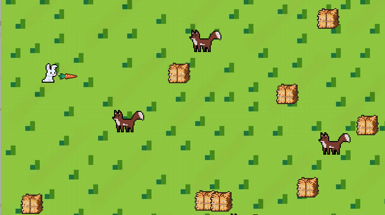

# Abyss: Escape of the bunny



## Description

Welcome to "Abyss," a thrilling pixel art game where you control a courageous bunny trying to escape from a pack of relentless wolves. Armed with bitten carrots, the bunny defends itself by throwing these at the wolves, who detest the taste and will flee. Your objective is simple: survive for as long as possible in the dangerous wolf territory.

## Features

- **Pixel Art Graphics**: Enjoy retro-style visuals that immerse you in a nostalgic gaming experience.
- **Unique Gameplay**: Use bitten carrots as your defense mechanism against the pursuing wolves.
- **Survival Challenge**: Test your reflexes and strategy as you evade and fight off wolves to stay alive.

## Controls

- **Arrow Keys**: Move the bunny in the corresponding direction.
- **Spacebar**: Throw a bitten carrot in the direction the bunny is facing.

## Installation

1. Clone the repository using the following command:

```bash
git clone htpps://github.com/miguelcsx/abyss.git
```

2. Navigate to the project directory:

```bash
cd abyss
```

3. Install the required dependencies:

```bash
pip install -r requirements.txt
```

4. Run the game:

```bash
python abyss.py
```

## License

This project is licensed under the MIT License - see the [LICENSE](LICENSE) file for details.

